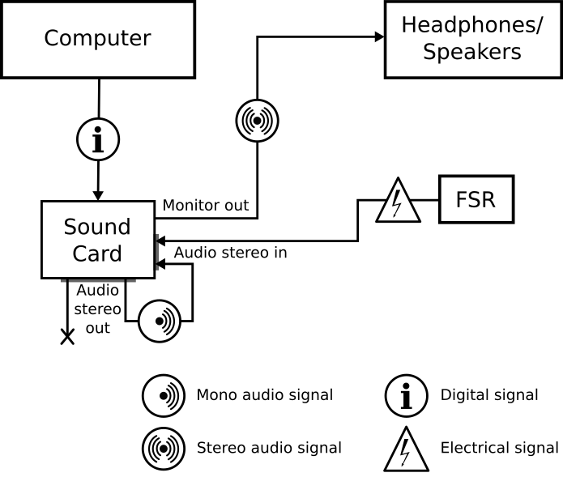
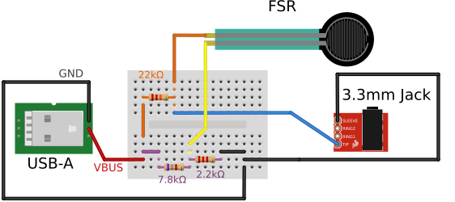
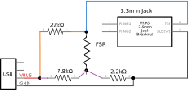

# Simple and Cheap Setup for Measuring Timed Responses to Auditory Stimuli

This repository holds further instructions to assembly and use the proposed
setup in _"Simple and Cheap Setup for Measuring Timed Responses 
to Auditory Stimuli"_ (Miguel et al., under review). 

## The setup

The setup allows recording response times with respect to an auditory stimuli
by using a sound card with stereo input and output as an inexpensive
acquisition device. To sychronize the responses to the stimulus, one channel of
the output must be looped back into one of the input channels of the recording
device. The other channel of the recording is used to capture the signal from
the input device. For simplicty, we also consider the recording device to have
an extra output connection than can be used to connect speakers or headphones.
Inexpensive USB external sound cards provide these capabilities.

## The input device

We propose using a Force Sensitive Resistor (FSR) as an input device. The FSR
is a sensor shaped as a flat surface that works as a resistor whose resistance
drops when it receives pressure. The signal produced by this sensor is clear,
as it is close to 0 when at rest and raises rapidly as is receives pressure.

In other for the FSR to work, it must be connected to a voltage source. We
propose using the 5V pin of a USB (type-a) connector. We then connect it to
a 3.5mm audio jack. This allows connecting the input device to the sound card
with standard audio cables. It must be used in a voltage divisor circuit to
limit the voltage that arrives at the sound card. 

Below we provide schematics describing how to assembly the input device.

